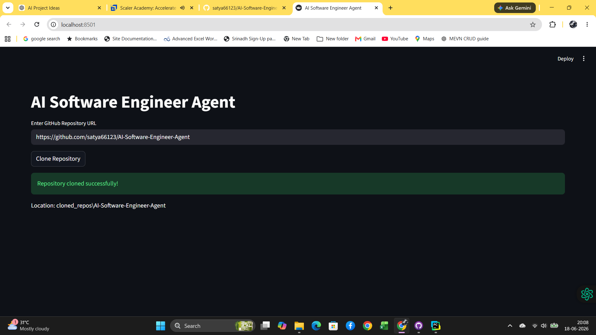
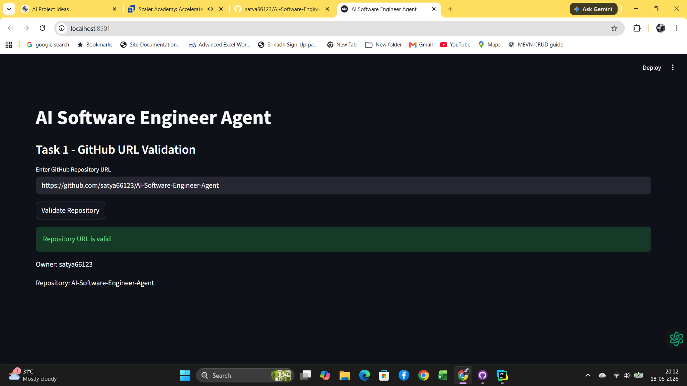
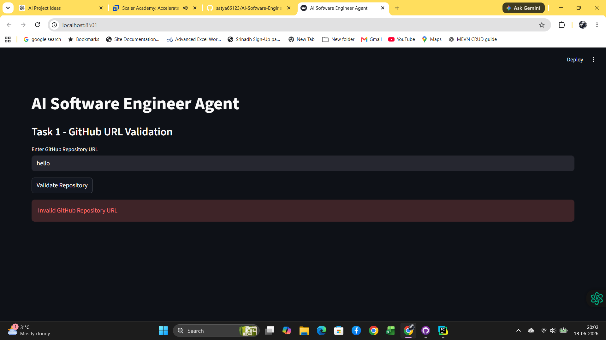

# 🤖 AI Software Engineer Agent


---

# 🚀 Overview

**AI Software Engineer Agent** is a professional AI-powered repository intelligence platform that helps developers understand, analyze, review, document, secure, and improve software projects using both **local LLMs (Ollama)** and **cloud LLMs (OpenAI)**.

It combines Retrieval-Augmented Generation (RAG), Repository Intelligence, AI Engineering Agents, Code Review, Security Analysis, Documentation Generation, Architecture Analysis, and Report Export into a single Streamlit application.

The project provides two interfaces:

* 📑 Tab-Based UI (`app.py`)
* 📂 Sidebar-Based UI (`app2.py`)

---

# ✨ Features

## 📂 Repository Analysis

* Repository Cloning
* Repository Scanning
* Programming Language Detection
* Repository Statistics
* Project Structure Viewer
* README Analysis
* AI Project Summary

---

## 🧠 AI Providers

Supports both local and cloud AI models.

### 🟢 Ollama

* qwen3
* qwen2.5
* llama3
* llama3.1
* mistral
* gemma2
* gemma3
* phi3
* deepseek-coder

### 🔵 OpenAI

* GPT-4o
* GPT-4o Mini
* GPT-4.1
* GPT-4.1 Mini
* GPT-3.5 Turbo

Switch between providers directly from the application settings.

---

# 📚 Repository Intelligence (RAG)

* Repository Indexing
* Semantic Search
* Context-aware Question Answering
* Repository Knowledge Base
* Vector Embeddings
* Hybrid Search (Hybrid/BM25)
* AI Re-ranking
* Source Citation
* Retrieved Chunks Viewer
* Multi-file Context Retrieval

### Embedding Models

#### Ollama

* nomic-embed-text

#### OpenAI

* text-embedding-3-small

---

# 🤖 AI Engineering Agents

* Code Explainer
* Documentation Generator
* Bug Finder
* Unit Test Generator
* Refactoring Advisor
* Dependency Analyzer
* Architecture Analyzer
* API Documentation Generator
* Code Flow Analyzer
* Multi-file Analyzer
* Security Analyzer
* Code Reviewer
* Pull Request Review Agent
* Feature Generator
* Code Generator

---

# 📊 Dashboard

Interactive analytics dashboard showing:

* Total Files
* Total Lines of Code
* Programming Languages
* File Extension Distribution
* Repository Health
* AI Usage Statistics
* Generated Reports
* Repository Metrics

---

# 📄 Export Reports

Export complete project analysis as:

* PDF
* DOCX
* TXT

---

# ⚙️ Application Features

* Provider Selection
* Model Selection
* Settings Management
* Usage Statistics
* Logging System
* Session Management
* Repository History
* AI Prompt Management

---

# 🏗 Project Architecture

```text
AI-Software-Engineer-Agent
│
├── app.py
├── app2.py
│
├── cloned_repos/
├── data/
├── docs/
├── exports/
├── logs/
├── tests/
│
└── src/
    ├── agents/
    ├── analytics/
    ├── github/
    ├── rag/
    ├── reports/
    ├── settings/
    ├── usage/
    └── utils/
```

---

# 🛠 Technology Stack

## Frontend

* Streamlit

## Backend

* Python

## AI

* Ollama
* OpenAI API


# 🤖 Supported Models

## Ollama

- qwen3
- qwen2.5
- llama3
- llama3.1
- mistral
- gemma2
- gemma3
- phi3
- deepseek-coder

## OpenAI

- GPT-4o
- GPT-4o Mini
- GPT-4.1
- GPT-4.1 Mini
- GPT-3.5 Turbo

## Embedding Models

- nomic-embed-text
- text-embedding-3-small

## Reporting

* ReportLab
* python-docx

## Storage

- JSON Vector Store
- Repository Index
- Configuration Files


## Utilities

* Logging
* Session State
* Settings Management


# 📚 Repository Intelligence (RAG)

- Repository Indexing
- Semantic Search
- BM25 Keyword Search
- Hybrid Search (Semantic + BM25)
- AI Re-ranking
- Repository Question Answering
- Context-aware Retrieval
- Retrieved Chunks Viewer
- Source Attribution
- Multi-file Context Retrieval
- Vector Embeddings

---

## Rag Pipeline

```
User Question
      │
      ▼
Hybrid Search
  ├── Semantic Search
  └── BM25 Search
      │
      ▼
AI Re-ranking
      │
      ▼
Context Generation
      │
      ▼
OpenAI / Ollama
      │
      ▼
Repository Answer 
```
````
## 📸 Screenshots & Sample Reports

The project includes screenshots of every major feature and sample exported reports for reference.

### 📷 Application Screenshots

Explore screenshots demonstrating the complete workflow of the application, including:

* Repository Validation
* Repository Cloning
* Repository Statistics
* Project Structure
* README Analysis
* AI Project Summary
* Repository Indexing
* Repository Q&A
* Code Explainer
* Documentation Generator
* Bug Finder
* Unit Test Generator
* Refactoring Advisor
* Dependency Analyzer
* Architecture Analyzer
* API Documentation Generator
* Code Flow Analyzer
* Multi-file Analyzer
* Security Analyzer
* Code Reviewer
* Pull Request Review
* Feature Generator
* Code Generator
* Dashboard
* Export Reports
* Settings
* Usage Statistics

👉 **View all screenshots here:**

https://github.com/satya66123/AI-Software-Engineer-Agent/tree/main/docs/screenshots

---

### 📄 Sample Exported Reports

The repository also contains sample reports generated by the application.

Available export formats include:

* PDF Reports
* DOCX Reports
* TXT Reports

👉 **View sample exported files here:**

https://github.com/satya66123/AI-Software-Engineer-Agent/tree/main/docs/exportfiles

📂 Project Data & Configuration

The project stores repository indexes, vector embeddings, application settings, and generated reports in the data directory.

📁Vector  Data Files

The following files are automatically created and managed by the application:

ollama_vectors.json – Stores repository vector embeddings generated using Ollama.
openai_vectors.json – Stores repository vector embeddings generated using OpenAI.

📂 Browse the data directory:

https://github.com/satya66123/AI-Software-Engineer-Agent/tree/main/data

📁 Setings Data Files

settings.json – Stores application settings such as the selected AI provider, default model, and user preferences.

📂 Browse the settings.json directory:

https://github.com/satya66123/AI-Software-Engineer-Agent/

---

````

---

# 🚀 Installation

## Clone Repository

```bash
git clone https://github.com/satya66123/AI-Software-Engineer-Agent.git
cd AI-Software-Engineer-Agent
```

## Create Virtual Environment

```bash
python -m venv .venv
```

## Activate

Windows

```bash
.venv\Scripts\activate
```

Linux / macOS

```bash
source .venv/bin/activate
```

## Install Dependencies

```bash
pip install -r requirements.txt
```

---

# 🔑 Environment Variables

Create a `.env` file.

```env
OPENAI_API_KEY=your_openai_api_key
```

If using only Ollama, the OpenAI key is optional.

---

# ▶️ Run Application

Tab Version

```bash
streamlit run app.py
```

Sidebar Version

```bash
streamlit run app2.py
```

---

# 🎯 Use Cases

* Repository Analysis
* AI Code Review
* Documentation Automation
* Security Assessment
* API Documentation
* Software Architecture Analysis
* Technical Interview Preparation
* Learning Large Codebases
* AI-assisted Development

---

---

# 📸 Application Screenshots

## Repository Cloning

### Repository Cloned Successfully

<p align="center">
  
</p>

---

## Repository Validation

### Repository URL Validation - Success

<p align="center">
  
</p>

### Repository URL Validation - Failed

<p align="center">
  
</p>

---

## 📸 Screenshots & Sample Reports

### 📷 Application Screenshots

📂 **Browse all screenshots:**  
https://github.com/satya66123/AI-Software-Engineer-Agent/tree/main/docs/screenshots

### 📄 Sample Exported Reports

📂 **Browse sample reports:**  
https://github.com/satya66123/AI-Software-Engineer-Agent/tree/main/docs/exportfiles


---


# 📈 Project Status

```text
Repository Analysis        ✅
RAG Search                 ✅
Repository Q&A             ✅
Code Explainer             ✅
Documentation Generator    ✅
Bug Finder                 ✅
Unit Test Generator        ✅
Refactoring Advisor        ✅
Dependency Analyzer        ✅
Architecture Analyzer      ✅
API Documentation          ✅
Code Flow Analysis         ✅
Multi-file Analysis        ✅
Security Analysis          ✅
Code Review                ✅
PR Review                  ✅
Feature Generator          ✅
Code Generator             ✅
Dashboard                  ✅
Export Reports             ✅
OpenAI Integration         ✅
Ollama Integration         ✅
BM25 Search                ✅
Hybrid Search              ✅
AI Re-ranking              ✅
Semantic Search            ✅

Overall Completion         100%
```

---

# 🔮 Future Enhancements

The AI Software Engineer Agent has been designed with extensibility in mind. Planned future improvements include:

## 🤖 AI & LLM

* Multi-Agent Collaboration
* Autonomous Software Engineering Agents
* AI Planning & Task Decomposition
* AI Pair Programming
* Agent Memory
* Tool Calling Support
* Function Calling
* AI Workflow Automation

---

## 🧠 Repository Intelligence

* Cross-Repository Search
* Repository Comparison
* Dependency Graph Visualization
* Repository Timeline Analysis
* Intelligent Repository Recommendations
* Repository Health Score
* Automatic Codebase Index Refresh

---

## 💬 AI Chat

* Multi-turn Repository Conversations
* Chat History
* Context Memory
* Conversation Export
* Voice-based Repository Q&A
* AI Coding Assistant Chat
* Streaming Responses
* Real-time Token Usage

---

## 🏗 Software Engineering

* UML Diagram Generation
* Sequence Diagram Generation
* Activity Diagram Generation
* Class Diagram Generation
* Use Case Diagram Generation
* Architecture Diagram Generation
* ER Diagram Generation
* Automatic Design Documentation

---

## 🔍 Advanced Code Analysis

* Dead Code Detection
* Duplicate Code Detection
* Cyclomatic Complexity Analysis
* Maintainability Index
* Technical Debt Analysis
* Design Pattern Detection
* SOLID Principle Evaluation
* Clean Code Analysis

---

## 🔐 Security

* OWASP Security Analysis
* Secret Detection
* Dependency Vulnerability Scanning
* License Compliance Checking
* Secure Coding Recommendations
* CVE Database Integration
* Security Risk Dashboard

---

## 🧪 Testing

* Integration Test Generation
* API Test Generation
* UI Test Generation
* Test Coverage Analysis
* Mock Data Generation
* Performance Testing Suggestions
* Regression Test Generation

---

## ☁️ Cloud Integration

* GitHub API Integration
* GitLab Integration
* Bitbucket Support
* Azure DevOps Support
* Docker Integration
* Kubernetes Analysis
* CI/CD Pipeline Review
* GitHub Actions Analysis

---

## 📊 Analytics

* AI Usage Dashboard
* Project Quality Score
* Repository Trend Analysis
* Team Productivity Metrics
* Developer Insights
* AI Performance Metrics
* Cost Analytics
* Token Usage Analytics

---

## 📄 Documentation

* Complete Project Documentation Generator
* API Reference Generator
* Markdown Documentation
* HTML Documentation
* Interactive Documentation Portal
* Software Design Specification Generator
* Technical Report Generator

---

## 🌐 OpenAI & Ollama Enhancements

* Automatic Provider Switching
* Intelligent Model Selection
* Model Performance Benchmarking
* Multi-Model Response Comparison
* Local + Cloud Hybrid Inference
* Automatic Fallback Between Providers
* Custom Prompt Templates
* Model Configuration Profiles

---

## 🎨 User Experience

* Modern Dashboard UI
* Dark & Light Themes
* Drag-and-Drop Repository Upload
* Repository Bookmarks
* Workspace Management
* Multi-user Authentication
* User Roles & Permissions
* Notification Center

---

## 📱 Deployment

* Docker Support
* Kubernetes Deployment
* Desktop Application (PyInstaller)
* Electron Desktop Client
* Mobile Companion App
* Cloud Deployment Templates

---

## 🚀 Long-Term Vision

The long-term vision is to evolve **AI Software Engineer Agent** into a comprehensive **AI-powered Software Engineering Platform** capable of:

* Understanding complete software systems.
* Assisting developers throughout the Software Development Life Cycle (SDLC).
* Performing autonomous repository analysis and engineering tasks.
* Supporting both local (Ollama) and cloud (OpenAI) AI models seamlessly.
* Acting as an intelligent software engineering assistant for developers, teams, students, and enterprises.

---

# 📅 Planned Roadmap

| Version  | Planned Features                               |
|----------| ---------------------------------------------- |
| **v1.1** | UML Generation, Architecture Visualization     |
| **v1.2** | GitHub API Integration, CI/CD Analysis         |
| **v1.3** | Multi-Agent Collaboration, Workflow Automation |
| **v1.4** | Security Dashboard, Advanced Code Metrics      |
| **v2.0** | Autonomous AI Software Engineering Platform    |

---

# 👨‍💻 Author

**Nekkanti Satya Srinath**

* GitHub: https://github.com/satya66123/AI-Software-Engineer-Agent
* LinkedIn: https://www.linkedin.com/in/satya-srinath-nekkanti-08b012a3/

---

# 📜 License

This project is licensed under the **MIT License**.

---

⭐ If you find this project useful, consider giving it a **Star** on GitHub.
